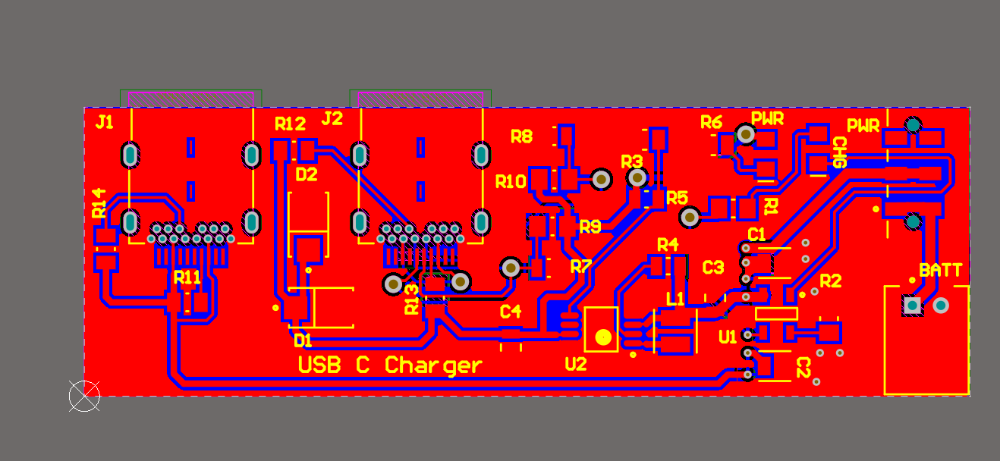

# USB-C Charger

A USB-C charger hardware design project developed using Altium Designer. This project includes schematic design, PCB layout, component libraries, manufacturing outputs, and project documentation.

## Project Overview

The goal of this project is to design a functional USB-C charger system with efficient power management and charging circuitry. The design process includes:

- Schematic design
- PCB layout design
- Component selection
- Design Rule Check (DRC)
- Gerber generation for manufacturing
- 2D and 3D PCB visualization

## Features

- USB-C based charging design
- Charge controller implementation
- Step-Up DC-DC converter design
- Custom component libraries
- PCB design with Altium Designer
- Manufacturing-ready Gerber files
- DRC verification

## Project Structure

```text
USB-C Charger/
│
├── Charge Controller.SchDoc
├── Step-Up DC-DC Converter.SchDoc
├── USB-C Charger.PcbDoc
├── USB-C Charger.PrjPcb
├── CustomLib
├── Gerber
├── NCDrill
├── USB-C Charger BOM
├── 2D.png
├── 3D Model.png
├── Charger Controller.png
├── DRC.png
└── README.md
```

## Design Preview

### PCB 2D View


### PCB 3D View


### Charge Controller Circuit


### Step-Up DC-DC Converter


## Tools Used

- Altium Designer
- PCB Design
- Schematic Capture
- DRC Verification
- Gerber Generation

## Outputs Included

- PCB Layout
- Schematics
- BOM
- Gerber files
- Drill files
- Images
- Libraries

## Author

**Dev Gohel**  
Master's in Electrical and Computer Engineering  
Illinois Institute of Technology

LinkedIn: https://www.linkedin.com/in/devgohel/  
GitHub: https://github.com/devmgohel17
